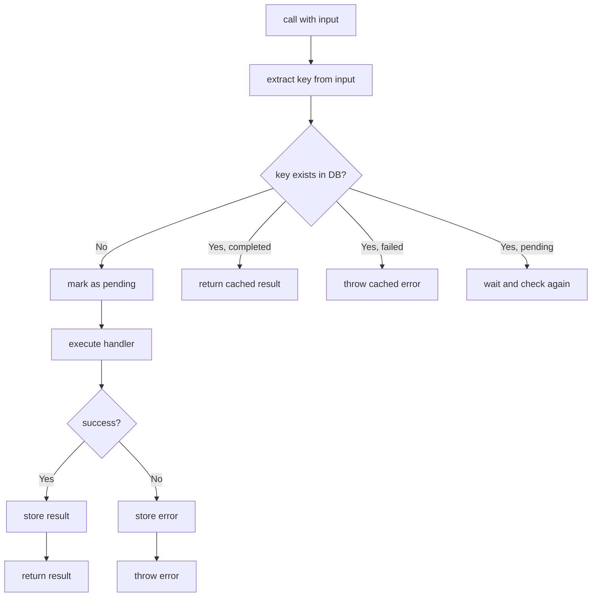
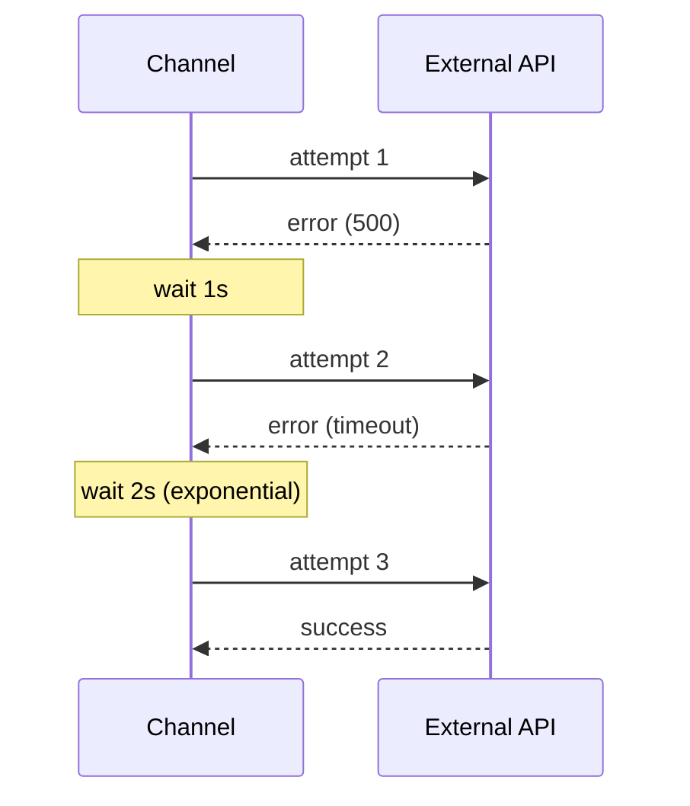
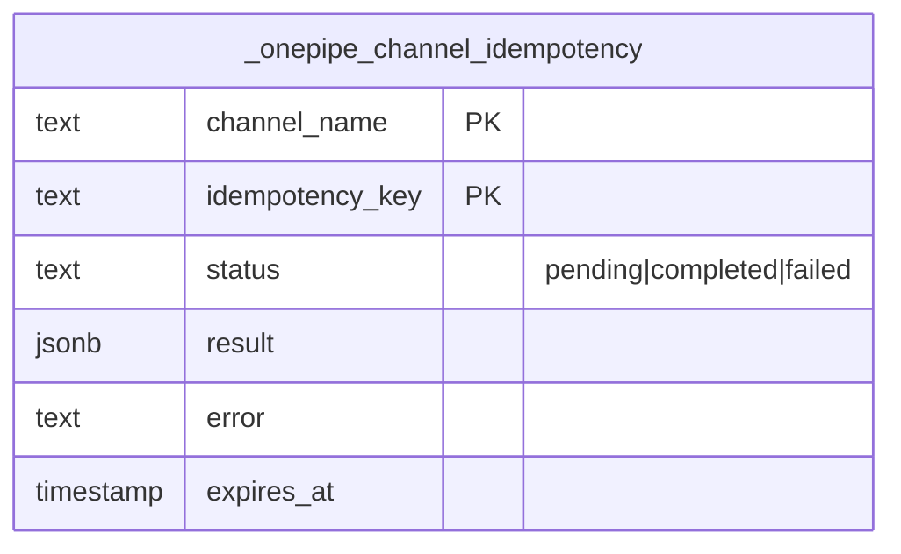

# Channel - RPC with Guarantees

Function calls with retry, timeout, and idempotency. For when "just call it" isn't enough.

## The Problem

You're charging a credit card:

```typescript
async function charge(orderId, amount) {
  return await stripe.charges.create({ amount, metadata: { orderId } })
}
```

What if:
- The network times out?
- Stripe is temporarily down?
- Your server crashes mid-request?
- The user clicks "Pay" twice?

Each of these can result in duplicate charges or lost transactions.

## The Solution

```typescript
const charge = Channel.create('charge-card')
  .input(z.object({ orderId: z.string(), amount: z.number() }))
  .db(postgres)
  .idempotency((input) => input.orderId)  // same orderId = same result
  .retry({ attempts: 3, backoff: 'exponential' })
  .timeout('30s')
  .handler(async (input) => {
    return await stripe.charges.create({
      amount: input.amount,
      metadata: { orderId: input.orderId }
    })
  })
  .build()

// Call it - safe to retry
const result = await charge.call({ orderId: 'order-123', amount: 5000 })
```

## How Idempotency Works



Same input key = same output. The first call executes, subsequent calls return the cached result.

```typescript
// First call - executes handler
await charge.call({ orderId: '123', amount: 100 })

// Second call - returns cached result (no Stripe call)
await charge.call({ orderId: '123', amount: 100 })

// Different orderId - executes handler
await charge.call({ orderId: '456', amount: 100 })
```

## Builder Options

```typescript
Channel.create('name')
  .input(zodSchema)           // validate input
  .output(zodSchema)          // validate output
  .handler(async (input) => { ... })
  .db(postgres)               // for idempotency
  .idempotency((input) => key) // extract unique key
  .retry({ attempts: 3, backoff: 'exponential' })
  .timeout('30s')
  .trace()                    // OpenTelemetry spans
  .build()
```

## Retry



```typescript
const fetchData = Channel.create('fetch-data')
  .retry({
    attempts: 3,           // max tries
    delay: 1000,           // initial delay (ms)
    backoff: 'exponential' // 1s, 2s, 4s...
  })
  .handler(async (input) => {
    const res = await fetch('https://flaky-api.com/data')
    if (!res.ok) throw new Error('API error')
    return res.json()
  })
  .build()
```

## Timeout

```typescript
const slowOp = Channel.create('slow-operation')
  .timeout('30s')  // or '5m', '1h', or 30000 (ms)
  .handler(async (input) => {
    // Throws if takes > 30 seconds
    return await verySlowThing(input)
  })
  .build()
```

## Idempotency Table

When you use `.db(postgres)` + `.idempotency()`:



Results are cached. The key function determines what "same call" means:

```typescript
// Same orderId = same result
.idempotency((input) => input.orderId)

// Same user + action = same result
.idempotency((input) => `${input.userId}-${input.action}`)

// Every call is unique (no idempotency)
.idempotency((input) => crypto.randomUUID())
```

## Example: Payment Processing

```typescript
const processPayment = Channel.create('process-payment')
  .input(z.object({
    orderId: z.string(),
    customerId: z.string(),
    amount: z.number(),
    currency: z.string()
  }))
  .output(z.object({
    transactionId: z.string(),
    status: z.string()
  }))
  .db(postgres)
  .idempotency((i) => i.orderId)
  .retry({ attempts: 3, backoff: 'exponential' })
  .timeout('30s')
  .handler(async (input) => {
    const charge = await stripe.charges.create({
      amount: input.amount,
      currency: input.currency,
      customer: input.customerId
    })
    return {
      transactionId: charge.id,
      status: charge.status
    }
  })
  .build()
```

## Example: External API

```typescript
const geocode = Channel.create('geocode-address')
  .input(z.object({ address: z.string() }))
  .output(z.object({ lat: z.number(), lng: z.number() }))
  .retry({ attempts: 3, delay: 500, backoff: 'linear' })
  .timeout('10s')
  .handler(async ({ address }) => {
    const res = await fetch(
      `https://maps.googleapis.com/maps/api/geocode/json?address=${encodeURIComponent(address)}`
    )
    const data = await res.json()
    const { lat, lng } = data.results[0].geometry.location
    return { lat, lng }
  })
  .build()
```

## Example: Email with Deduplication

```typescript
const sendEmail = Channel.create('send-email')
  .input(z.object({
    to: z.string().email(),
    templateId: z.string(),
    data: z.record(z.any())
  }))
  .db(postgres)
  .idempotency((i) => `${i.to}-${i.templateId}-${JSON.stringify(i.data)}`)
  .handler(async (input) => {
    await resend.emails.send({
      to: input.to,
      template_id: input.templateId,
      data: input.data
    })
    return { sent: true }
  })
  .build()

// Safe to call multiple times
await sendEmail.call({ to: 'user@example.com', templateId: 'welcome', data: {} })
await sendEmail.call({ to: 'user@example.com', templateId: 'welcome', data: {} }) // no-op
```

## Tips

**Use idempotency for anything with side effects** - Payments, emails, writes to external systems.

**Set timeouts** - External services can hang. Don't let them block forever.

**Use exponential backoff** - Gives the external service time to recover.

**The idempotency key matters** - Too narrow (orderId only) may be too strict. Too broad (random UUID) gives no protection.
