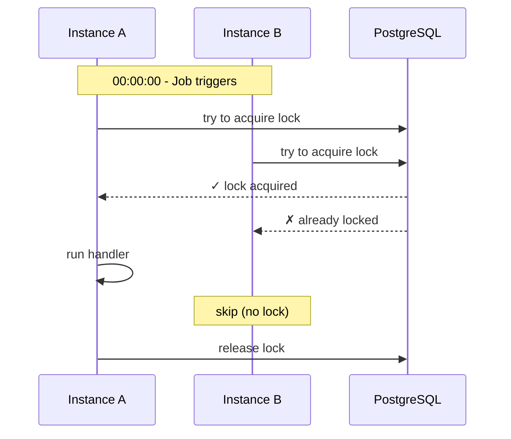
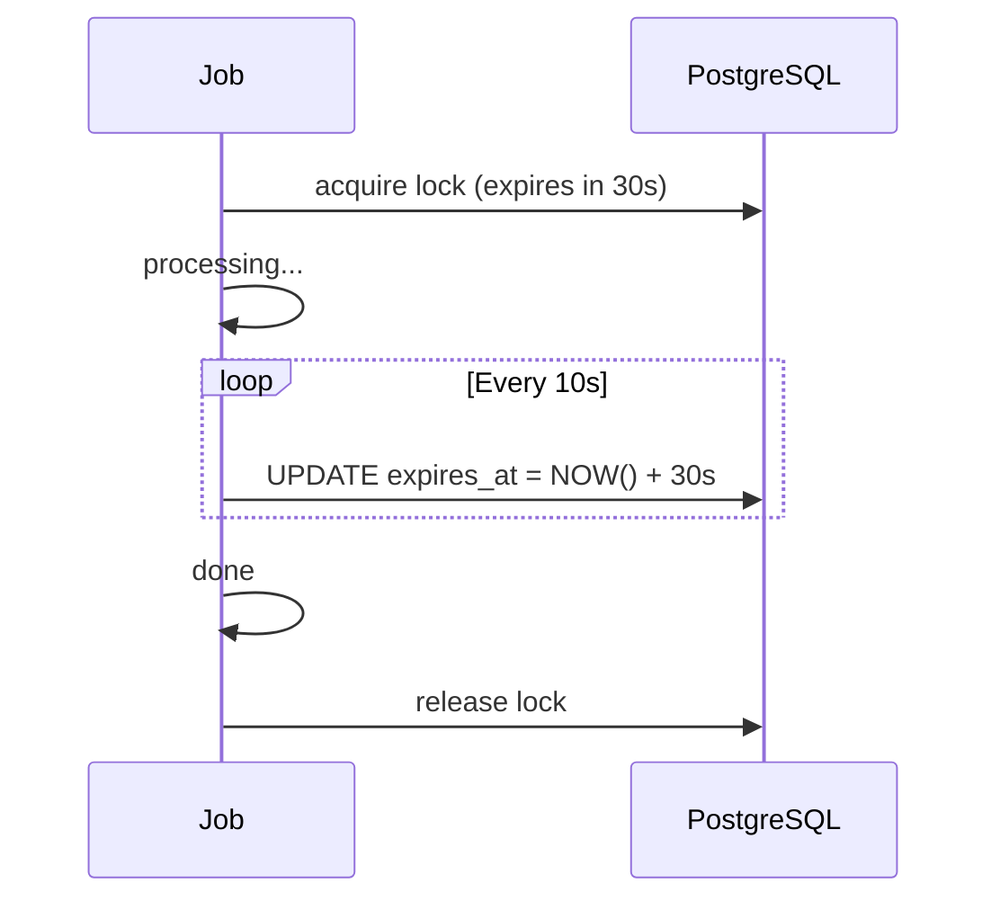
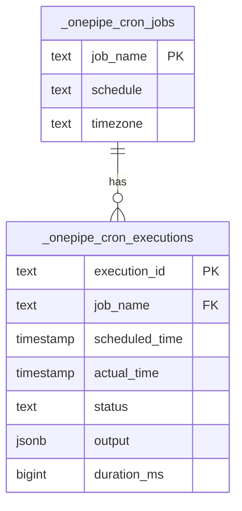

# Cron - Scheduled Jobs

Run jobs on a schedule. With PostgreSQL, only one instance runs the job (even if you have 10 replicas).

## The Problem

You're running 3 instances of your app. Each has:

```typescript
setInterval(() => cleanupExpiredSessions(), 60 * 60 * 1000)
```

Now your cleanup runs 3 times per hour. Not great.

## The Solution

```typescript
const cleanup = Cron.create('cleanup')
  .schedule('0 * * * *')  // every hour
  .db(postgres)           // enables distributed locking
  .handler(async () => {
    await db.query('DELETE FROM sessions WHERE expires_at < NOW()')
  })
  .build()
```

With `.db(postgres)`, only one instance gets the lock. Others skip.

## How Locking Works



The lock is a row in `_onepipe_cron_locks`. Whoever inserts first wins.

```sql
INSERT INTO _onepipe_cron_locks (job_name, locked_by, expires_at)
VALUES ('cleanup', 'instance-uuid', NOW() + '30 seconds')
ON CONFLICT (job_name) DO UPDATE
SET locked_by = ..., expires_at = ...
WHERE expires_at < NOW()  -- only if lock is expired
RETURNING 1
```

If it returns a row, you got the lock.

## Basic Usage

```typescript
import { Cron } from '@onepipe/sdk'

const dailyReport = Cron.create('daily-report')
  .schedule('0 9 * * *')  // 9am daily
  .db(postgres)
  .handler(async (ctx) => {
    const stats = await ctx.db.query('SELECT COUNT(*) FROM orders WHERE date = TODAY()')
    await sendSlackMessage(`Daily orders: ${stats[0].count}`)
    return { sent: true }
  })
  .build()
```

## Cron Expressions

```
┌─────────── minute (0-59)
│ ┌───────── hour (0-23)
│ │ ┌─────── day of month (1-31)
│ │ │ ┌───── month (1-12)
│ │ │ │ ┌─── day of week (0-6, Sun-Sat)
* * * * *
```

| Expression | When |
|------------|------|
| `* * * * *` | Every minute |
| `0 * * * *` | Every hour |
| `0 0 * * *` | Midnight daily |
| `0 9 * * 1-5` | 9am weekdays |
| `*/15 * * * *` | Every 15 minutes |
| `0 0 1 * *` | First of month |

## Builder Options

```typescript
Cron.create('name')
  .schedule('* * * * *')    // cron expression
  .db(postgres)             // required for locking
  .timezone('America/NYC')  // default: UTC
  .handler(async (ctx) => { ... })
  .trace()                  // OpenTelemetry spans
  .build()
```

## Handler Context

```typescript
.handler(async (ctx) => {
  ctx.jobName        // 'daily-report'
  ctx.scheduledTime  // when it was supposed to run
  ctx.actualTime     // when it actually ran
  ctx.executionId    // unique ID for this run
  ctx.db             // database (if configured)
})
```

## Long-Running Jobs

For jobs longer than 30 seconds, the lock needs to be refreshed. This happens automatically every 10 seconds:



If the job crashes, the lock expires after 30 seconds and another instance can pick it up.

## Trigger Manually

```typescript
// Run now, bypass schedule
const result = await cleanup.trigger()
console.log(result.output)
```

Still respects locking - won't run twice simultaneously.

## Trigger Workflow

Instead of inline handler, trigger a durable workflow:

```typescript
const monthlyBilling = Cron.create('monthly-billing')
  .schedule('0 0 1 * *')
  .db(postgres)
  .workflow(billingWorkflow, (ctx) => ({
    month: ctx.scheduledTime.toISOString().slice(0, 7)
  }))
  .build()
```

Good for jobs that need durability (can take hours, might need retry).

## Execution History



Query history:

```typescript
const history = await dailyReport.history({ limit: 10 })
for (const exec of history) {
  console.log(`${exec.scheduledTime}: ${exec.status} (${exec.durationMs}ms)`)
}
```

## Example: Cleanup Job

```typescript
const sessionCleanup = Cron.create('session-cleanup')
  .schedule('0 * * * *')  // every hour
  .db(postgres)
  .handler(async (ctx) => {
    const result = await ctx.db.query(`
      DELETE FROM sessions
      WHERE expires_at < NOW()
      RETURNING id
    `)
    return { deleted: result.length }
  })
  .build()
```

## Example: Daily Summary

```typescript
const dailySummary = Cron.create('daily-summary')
  .schedule('0 18 * * *')  // 6pm daily
  .timezone('America/New_York')
  .db(postgres)
  .handler(async (ctx) => {
    const [stats] = await ctx.db.query(`
      SELECT
        COUNT(*) as orders,
        SUM(total) as revenue
      FROM orders
      WHERE created_at >= CURRENT_DATE
    `)

    await slack.send(`
      Today's Summary:
      Orders: ${stats.orders}
      Revenue: $${stats.revenue}
    `)
  })
  .build()
```

## Tips

**Always use `.db()` in production** - Otherwise every instance runs every job.

**Keep handlers async** - Blocking code prevents heartbeat from renewing the lock.

**Use workflows for long jobs** - Cron triggers it, workflow handles durability.

**Check execution history** - Know if jobs are failing or taking too long.
