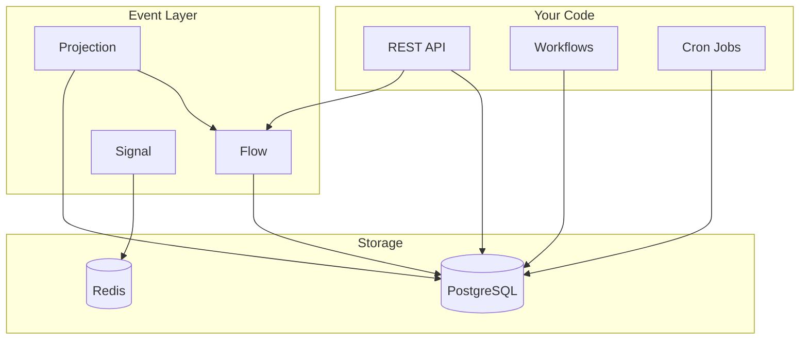
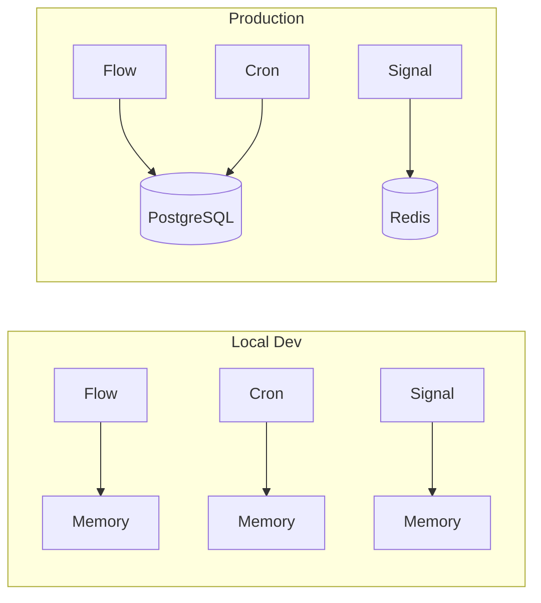
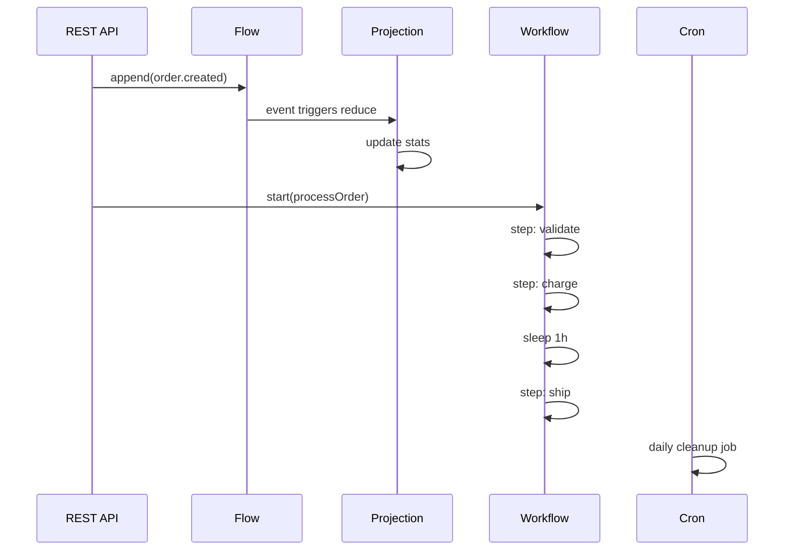

# SDK Overview

OnePipe gives you building blocks for backend apps. Instead of gluing together 5 different libraries, you get one consistent API.

## The Big Picture



Everything talks to PostgreSQL. That's the trick - one database handles durability for all primitives.

## What Each Primitive Does

| Primitive | One-liner | When to use |
|-----------|-----------|-------------|
| [Flow](./flow.md) | Append-only event log | Audit trails, event sourcing, activity feeds |
| [Projection](./projection.md) | Compute state from events | Dashboards, aggregates, derived data |
| [Workflow](./workflow.md) | Multi-step process that survives crashes | Order processing, onboarding, sagas |
| [Cron](./cron.md) | Scheduled jobs with distributed lock | Cleanup, reports, periodic tasks |
| [Signal](./signal.md) | Reactive state that syncs across instances | Feature flags, config, real-time state |
| [Channel](./channel.md) | RPC with retry and idempotency | Payment processing, external APIs |
| [REST](./rest.md) | HTTP API builder | Your API endpoints |
| [Lifecycle](./lifecycle.md) | Health checks and shutdown | Kubernetes/Cloud Run deployments |

## The Builder Pattern

Every primitive follows the same pattern:

```typescript
const thing = Primitive.create('name')
  .someConfig(...)
  .moreConfig(...)
  .build()
```

Why? Once you learn it for one primitive, you know it for all of them:

```typescript
// All look the same
Flow.create('events').db(postgres).build()
Cron.create('cleanup').schedule('0 * * * *').db(postgres).build()
Workflow.create('process').db(postgres).define(...).build()
Signal.create('config').cache(redis).build()
```

## Local vs Production

The key difference: `.db()` and `.cache()`.



Without `.db()`, everything runs in-memory. Fast for local dev, but state is lost on restart and doesn't sync across instances.

```typescript
// Local dev - fine for testing
const flow = Flow.create('events').build()

// Production - durable, multi-instance safe
const flow = Flow.create('events').db(postgres).build()
```

## How They Work Together

A typical order flow:



```typescript
// 1. REST receives request, appends event
const api = REST.create('orders')
  .post('/', async (ctx) => {
    const order = ctx.body()
    await orderEvents.append({ type: 'created', order })
    await processOrder.start(order)
    return ctx.created(order)
  })
  .build()

// 2. Flow stores events
const orderEvents = Flow.create('order-events').db(postgres).build()

// 3. Projection computes stats from events
const stats = Projection.create('order-stats')
  .from(orderEvents)
  .reduce((state, event) => {
    if (event.type === 'created') return { ...state, total: state.total + 1 }
    return state
  })
  .db(postgres)
  .build()

// 4. Workflow processes the order
const processOrder = Workflow.create('process-order')
  .db(postgres)
  .define(async (ctx, order) => {
    await ctx.step('validate', () => validate(order))
    await ctx.step('charge', () => charge(order))
    await ctx.sleep('1h')
    await ctx.step('ship', () => ship(order))
  })
  .build()

// 5. Cron cleans up old data
const cleanup = Cron.create('cleanup')
  .schedule('0 3 * * *')
  .db(postgres)
  .handler(() => postgres.query('DELETE FROM orders WHERE created_at < NOW() - INTERVAL 90 days'))
  .build()
```

## Database Tables

OnePipe creates tables prefixed with `_onepipe_`:

| Table | Used by |
|-------|---------|
| `_onepipe_flow_events` | Flow - stores events |
| `_onepipe_workflows` | Workflow - execution state |
| `_onepipe_workflow_steps` | Workflow - step results |
| `_onepipe_cron_jobs` | Cron - job registry |
| `_onepipe_cron_locks` | Cron - distributed locking |
| `_onepipe_projection_state` | Projection - aggregate state |
| `_onepipe_channel_idempotency` | Channel - deduplication |

Tables are created automatically on first use.

## Next Steps

Start with the primitives you need:

- Building an API? → [REST](./rest.md)
- Need event sourcing? → [Flow](./flow.md) + [Projection](./projection.md)
- Long-running processes? → [Workflow](./workflow.md)
- Scheduled jobs? → [Cron](./cron.md)
- Feature flags? → [Signal](./signal.md)
