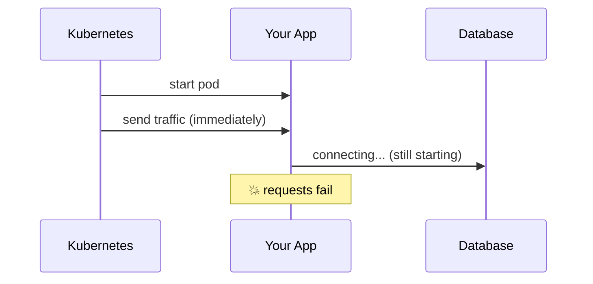
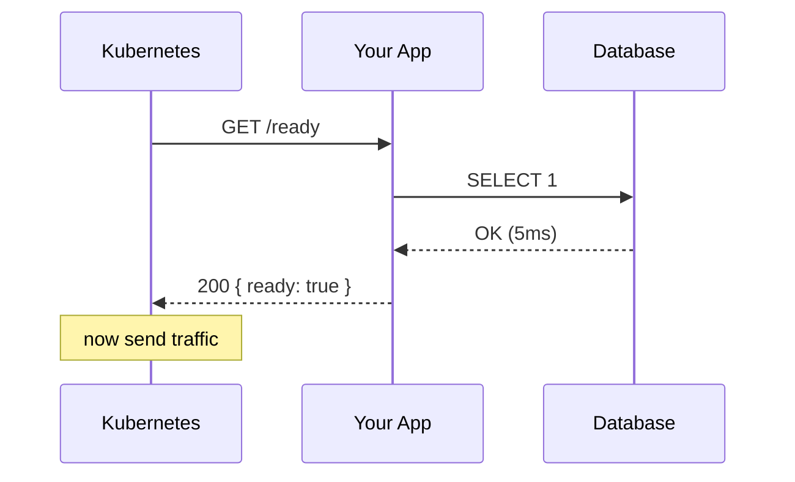
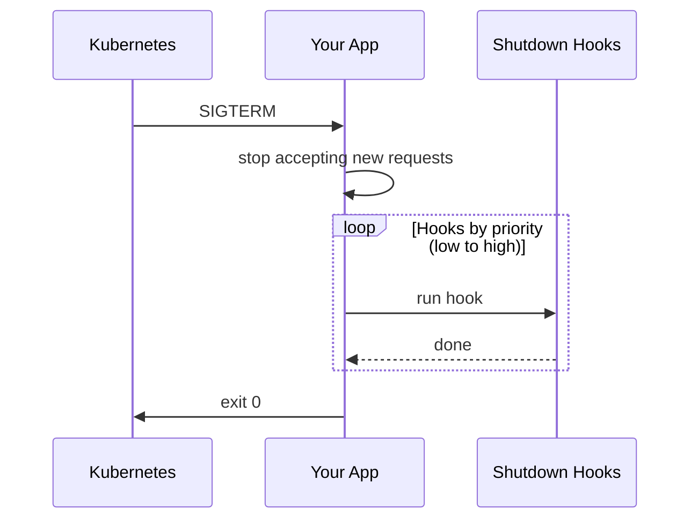

# Lifecycle - Health & Shutdown

Health checks for Kubernetes/Cloud Run, and graceful shutdown so you don't drop requests.

## The Problem

Kubernetes sends traffic before your app is ready. Or kills it while requests are in flight.



## The Solution

```typescript
import { Lifecycle } from '@onepipe/sdk'

const lifecycle = Lifecycle.create()
  .healthCheck('database', async () => {
    await db.query('SELECT 1')
  })
  .healthCheck('redis', async () => {
    await cache.ping()
  })
  .onShutdown('database', async () => {
    await db.close()
  }, 10)
  .onShutdown('cache', async () => {
    await cache.disconnect()
  }, 20)
  .build()

serve({ port: 3000, rest: [api], lifecycle })
```

## Health Endpoints

### `/health` - Liveness

"Is the process running?"

```
GET /health

200 OK
{
  "status": "healthy",
  "uptime": 3600
}
```

Kubernetes uses this to know if it should restart your pod.

### `/ready` - Readiness

"Can it handle traffic?"

```
GET /ready

200 OK
{
  "ready": true,
  "checks": [
    { "name": "database", "status": "healthy", "latencyMs": 5 },
    { "name": "redis", "status": "healthy", "latencyMs": 2 }
  ]
}
```

Kubernetes only sends traffic when this returns 200.



## Health Checks

```typescript
.healthCheck('name', async () => {
  // Throw if unhealthy
  await someDependency.ping()
})
```

If the function throws, the check fails. If it returns, it passes.

```typescript
// Database
.healthCheck('db', () => db.query('SELECT 1'))

// Redis
.healthCheck('redis', () => cache.ping())

// External API
.healthCheck('stripe', async () => {
  const res = await fetch('https://api.stripe.com/health')
  if (!res.ok) throw new Error('Stripe unhealthy')
})
```

## Graceful Shutdown

When Kubernetes sends SIGTERM:



```typescript
// Lower priority = runs first
.onShutdown('drain-requests', async () => {
  await new Promise(r => setTimeout(r, 5000))  // let in-flight finish
}, 1)

.onShutdown('database', async () => {
  await db.close()
}, 10)

.onShutdown('cache', async () => {
  await cache.disconnect()
}, 20)
```

## Timeout

Don't let shutdown hang forever:

```typescript
Lifecycle.create()
  .timeout(25000)  // 25 seconds max
  .healthCheck(...)
  .onShutdown(...)
  .build()
```

If hooks don't finish in time, the process exits anyway.

## Kubernetes Config

```yaml
apiVersion: apps/v1
kind: Deployment
spec:
  template:
    spec:
      containers:
        - name: app
          livenessProbe:
            httpGet:
              path: /health
              port: 3000
            initialDelaySeconds: 5
            periodSeconds: 10
          readinessProbe:
            httpGet:
              path: /ready
              port: 3000
            initialDelaySeconds: 5
            periodSeconds: 5
          lifecycle:
            preStop:
              exec:
                command: ["sleep", "5"]
      terminationGracePeriodSeconds: 30
```

The `preStop` sleep gives Kubernetes time to stop sending traffic before your app starts shutting down.

## Cloud Run Config

Cloud Run automatically sends SIGTERM and waits:

```yaml
apiVersion: serving.knative.dev/v1
kind: Service
spec:
  template:
    spec:
      timeoutSeconds: 300
      containers:
        - name: app
          startupProbe:
            httpGet:
              path: /ready
              port: 3000
```

## Manual Shutdown

```typescript
// Check if shutting down
if (lifecycle.isShuttingDown()) {
  return { error: 'Service shutting down' }
}

// Trigger shutdown programmatically
await lifecycle.shutdown()
```

## Full Example

```typescript
import { Lifecycle, DB, Cache } from '@onepipe/sdk'
import { serve } from '@onepipe/runtime'

const db = DB.create('main').postgres(process.env.DATABASE_URL).build()
const cache = Cache.create('main').redis(process.env.REDIS_URL).build()

const lifecycle = Lifecycle.create()
  .timeout(25000)

  // Health checks
  .healthCheck('db', () => db.query('SELECT 1'))
  .healthCheck('redis', () => cache.ping())

  // Shutdown order: drain first, then close connections
  .onShutdown('drain', async () => {
    console.log('Draining requests...')
    await new Promise(r => setTimeout(r, 5000))
  }, 1)

  .onShutdown('db', async () => {
    console.log('Closing database...')
    await db.close()
  }, 10)

  .onShutdown('redis', async () => {
    console.log('Closing Redis...')
    await cache.disconnect()
  }, 20)

  .build()

// Register signal handlers
lifecycle.register()

serve({
  port: 3000,
  rest: [api],
  lifecycle
})
```

## Tips

**Check all critical dependencies** - If the database is down, your app can't serve requests.

**Order shutdown hooks correctly** - Drain requests first, close connections last.

**Match timeout to K8s `terminationGracePeriodSeconds`** - Set lifecycle timeout slightly lower so hooks finish before Kubernetes kills the pod.

**Handle SIGTERM gracefully** - Don't just exit. Give in-flight requests time to complete.
