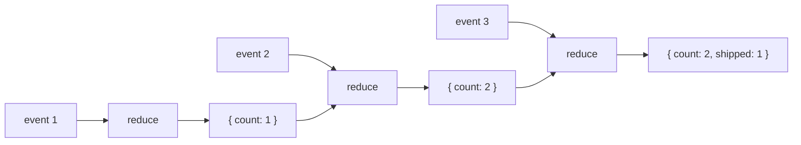
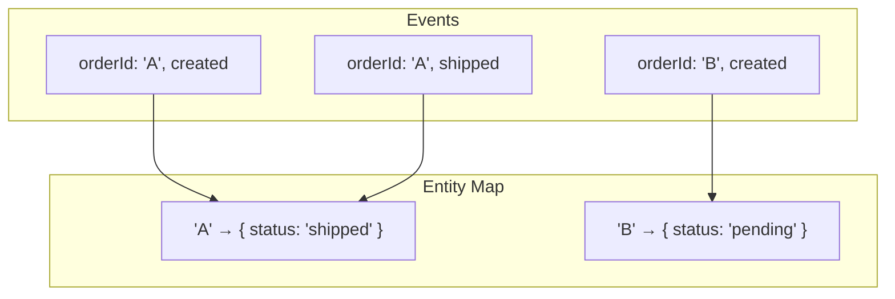
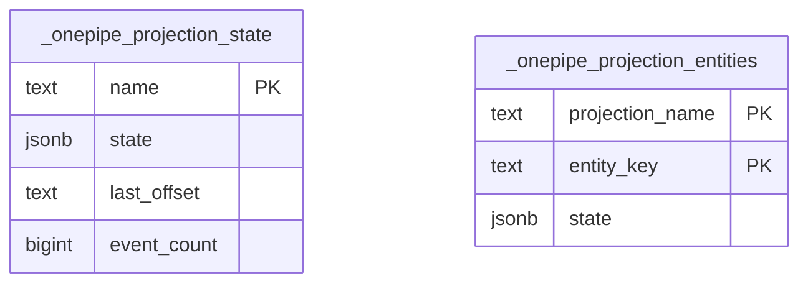

# Projection - State from Events

Build state by reducing over events. Classic event sourcing pattern.

## The Concept

You have a stream of events:

```
{ type: 'order.created', orderId: '1', amount: 100 }
{ type: 'order.created', orderId: '2', amount: 50 }
{ type: 'order.shipped', orderId: '1' }
{ type: 'order.created', orderId: '3', amount: 75 }
```

You want totals: how many orders, total revenue, how many shipped?

Instead of querying every time, you reduce events into state:



## Basic Usage

```typescript
import { Projection, Flow } from '@onepipe/sdk'

const orderEvents = Flow.create('orders').db(postgres).build()

const stats = Projection.create('order-stats')
  .from(orderEvents)
  .initial({ count: 0, revenue: 0, shipped: 0 })
  .reduce((state, event) => {
    switch (event.type) {
      case 'order.created':
        return {
          ...state,
          count: state.count + 1,
          revenue: state.revenue + event.amount
        }
      case 'order.shipped':
        return { ...state, shipped: state.shipped + 1 }
      default:
        return state
    }
  })
  .db(postgres)
  .build()

// Get current state
const { count, revenue, shipped } = await stats.get()
```

## Two Types of Projections

### Aggregate (single value)

All events reduce into one state object:

```typescript
const totals = Projection.create('totals')
  .from(events)
  .initial({ count: 0, sum: 0 })
  .reduce((state, event) => ({
    count: state.count + 1,
    sum: state.sum + event.amount
  }))
  .build()

await totals.get()  // { count: 150, sum: 45000 }
```

### Entity (keyed by ID)

Events reduce into a map of entities:

```typescript
const orders = Projection.create('orders-by-id')
  .from(orderEvents)
  .keyBy((event) => event.orderId)  // group by orderId
  .initial({ status: 'unknown', items: [] })
  .reduce((state, event) => {
    switch (event.type) {
      case 'order.created':
        return { status: 'pending', items: event.items }
      case 'order.shipped':
        return { ...state, status: 'shipped' }
      default:
        return state
    }
  })
  .build()

// Get one order
await orders.get('order-123')  // { status: 'shipped', items: [...] }

// Get all order IDs
await orders.keys()  // ['order-123', 'order-456', ...]
```



## Storage

### Memory (default)

```typescript
const proj = Projection.create('stats').from(flow).initial({}).reduce(...).build()
```

On restart, replays all events from the Flow to rebuild state. Works, but slow for large flows.

### PostgreSQL

```typescript
const proj = Projection.create('stats')
  .from(flow)
  .initial({})
  .reduce(...)
  .db(postgres)
  .build()
```

State persisted in `_onepipe_projection_state`. On restart, loads from there. Shared across instances.



## Subscribing to Changes

```typescript
// Get notified when state changes
const unsubscribe = stats.subscribe((state) => {
  console.log('Stats updated:', state)
})

// For entity projections, watch a specific key
const unsubscribe = orders.subscribeKey('order-123', (order) => {
  console.log('Order 123 changed:', order)
})
```

## Rebuilding

If you change your reduce function or something goes wrong:

```typescript
await projection.rebuild()
```

This clears the state and replays all events from the Flow.

## Common Patterns

### Counter

```typescript
.initial({ count: 0 })
.reduce((s, e) => ({ count: s.count + 1 }))
```

### Sum

```typescript
.initial({ total: 0 })
.reduce((s, e) => ({ total: s.total + e.amount }))
```

### Latest value

```typescript
.initial({ latest: null })
.reduce((s, e) => ({ latest: e.value }))
```

### Rolling window (last N)

```typescript
.initial({ items: [] })
.reduce((s, e) => ({
  items: [...s.items, e].slice(-100)  // keep last 100
}))
```

### State machine

```typescript
.initial({ status: 'pending' })
.reduce((s, e) => {
  const transitions = {
    pending: { approve: 'approved', reject: 'rejected' },
    approved: { complete: 'completed' }
  }
  const next = transitions[s.status]?.[e.action]
  return next ? { status: next } : s
})
```

## Example: Dashboard Stats

```typescript
const dashboard = Projection.create('dashboard')
  .from(userEvents)
  .initial({
    totalUsers: 0,
    activeToday: new Set(),
    signupsThisWeek: 0
  })
  .reduce((state, event) => {
    switch (event.type) {
      case 'user.signup':
        return {
          ...state,
          totalUsers: state.totalUsers + 1,
          signupsThisWeek: state.signupsThisWeek + 1
        }
      case 'user.login':
        return {
          ...state,
          activeToday: new Set([...state.activeToday, event.userId])
        }
      default:
        return state
    }
  })
  .db(postgres)
  .build()
```

## Example: Order Tracking

```typescript
const orders = Projection.create('orders')
  .from(orderEvents)
  .keyBy((e) => e.orderId)
  .initial({
    status: 'unknown',
    total: 0,
    items: [],
    timeline: []
  })
  .reduce((state, event) => {
    const timeline = [...state.timeline, { type: event.type, at: event.timestamp }]

    switch (event.type) {
      case 'created':
        return { ...state, status: 'pending', total: event.total, items: event.items, timeline }
      case 'paid':
        return { ...state, status: 'paid', timeline }
      case 'shipped':
        return { ...state, status: 'shipped', tracking: event.tracking, timeline }
      case 'delivered':
        return { ...state, status: 'delivered', timeline }
      default:
        return state
    }
  })
  .db(postgres)
  .build()

// API endpoint
app.get('/orders/:id', async (ctx) => {
  const order = await orders.get(ctx.params.id)
  if (!order) throw APIError.notFound('Order not found')
  return order
})
```

## Tips

**Keep reducers pure** - No side effects. Just compute new state from old state + event.

**Handle unknown events** - Always have a `default: return state` case.

**Use entity projections for lookups** - O(1) instead of filtering an array.

**Use `.db(postgres)` in production** - Memory mode rebuilds on every restart.

**Don't store too much in state** - Keep it focused. Create multiple projections for different views.
