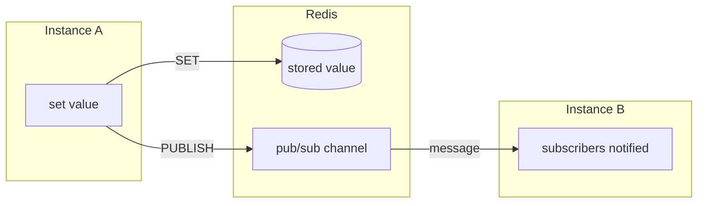
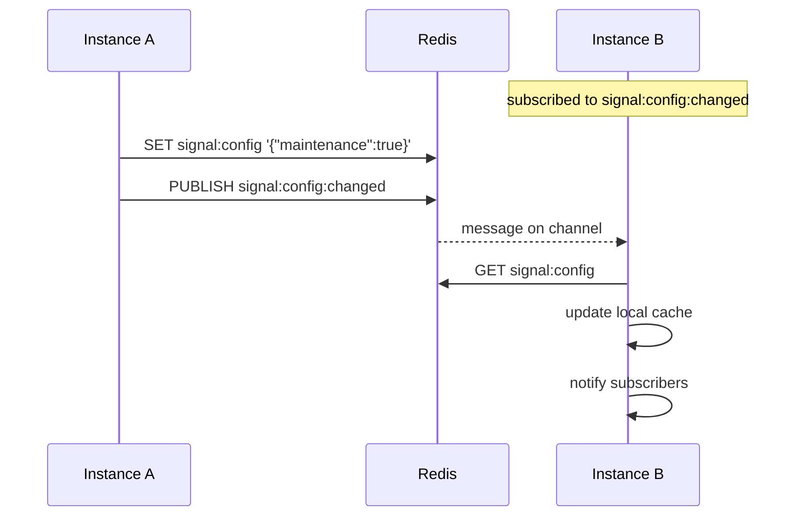
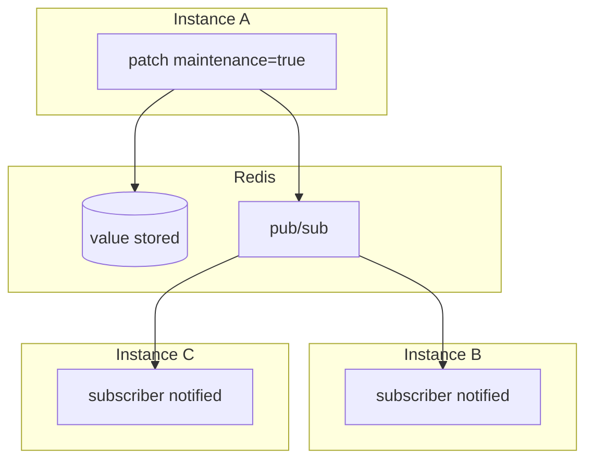

# Signal - Reactive State

Shared state that syncs across instances. Change it on one server, all servers see the change.

## What It Does



You set a value, it's stored in Redis, and all other instances get notified via pub/sub.

## Basic Usage

```typescript
import { Signal } from '@onepipe/sdk'
import { z } from 'zod'

const config = Signal.create('app-config')
  .schema(z.object({
    maintenance: z.boolean(),
    maxUploadMB: z.number()
  }))
  .default({ maintenance: false, maxUploadMB: 10 })
  .cache(redis)  // enables cross-instance sync
  .build()

// Read
const value = await config.get()

// Write
await config.set({ maintenance: true, maxUploadMB: 10 })

// Partial update
await config.patch({ maintenance: false })

// React to changes
config.subscribe((value) => {
  console.log('Config changed:', value)
})
```

## Builder Options

```typescript
Signal.create('name')
  .schema(zodSchema)     // validation
  .default(value)        // initial/fallback value
  .cache(redis)          // Redis for multi-instance
  .persist('sqlite')     // or local SQLite file
  .build()
```

## Storage Modes

### Memory (default)

```typescript
const flag = Signal.create('flag').default(false).build()
```

In-memory only. Lost on restart, not shared across instances.

### SQLite

```typescript
const config = Signal.create('config')
  .default({})
  .persist('sqlite')
  .build()
```

Persists to `.onepipe/signals/config.db`. Survives restart, but not shared across instances.

### Redis

```typescript
const config = Signal.create('config')
  .default({})
  .cache(redis)
  .build()
```

Stored in Redis, synced via pub/sub. This is what you want for production.

## How Redis Sync Works



## Operations

```typescript
// Get current value
const value = await signal.get()

// Set entire value
await signal.set({ maintenance: true, maxUploadMB: 20 })

// Partial update (merge)
await signal.patch({ maintenance: false })
// Result: { maintenance: false, maxUploadMB: 20 }

// Update with function
await signal.update((current) => ({
  ...current,
  counter: current.counter + 1
}))

// Reset to default
await signal.reset()
```

## Subscriptions

```typescript
// Get notified on change
const unsubscribe = signal.subscribe((value) => {
  console.log('New value:', value)
})

// Stop listening
unsubscribe()
```

## Wait for Condition

Sometimes you need to wait until a signal reaches a certain state:

```typescript
// Block until maintenance mode is off
await maintenance.waitFor((v) => !v.enabled, { timeout: 30000 })

// Now proceed
```

Useful for coordination between instances or waiting for external changes.

## Schema Validation

```typescript
const limits = Signal.create('rate-limits')
  .schema(z.object({
    requestsPerMinute: z.number().min(1).max(10000),
    burstSize: z.number().min(1)
  }))
  .default({ requestsPerMinute: 100, burstSize: 10 })
  .cache(redis)
  .build()

// TypeScript knows the type
const { requestsPerMinute } = await limits.get()

// Validation error if invalid
await limits.set({ requestsPerMinute: 999999 })  // throws: max is 10000
```

## Example: Feature Flags

```typescript
const features = Signal.create('features')
  .schema(z.object({
    newCheckout: z.boolean(),
    darkMode: z.boolean(),
    aiAssistant: z.boolean()
  }))
  .default({
    newCheckout: false,
    darkMode: true,
    aiAssistant: false
  })
  .cache(redis)
  .build()

// In your app
app.get('/checkout', async (ctx) => {
  const { newCheckout } = await features.get()

  if (newCheckout) {
    return renderNewCheckout()
  }
  return renderOldCheckout()
})

// Admin endpoint to toggle
app.post('/admin/features', async (ctx) => {
  const { feature, enabled } = ctx.body()
  await features.patch({ [feature]: enabled })
  return { ok: true }
})
```

## Example: Maintenance Mode

```typescript
const maintenance = Signal.create('maintenance')
  .schema(z.object({
    enabled: z.boolean(),
    message: z.string().optional()
  }))
  .default({ enabled: false })
  .cache(redis)
  .build()

// Middleware
app.use(async (ctx, next) => {
  const { enabled, message } = await maintenance.get()

  if (enabled) {
    return ctx.json({
      error: 'Service under maintenance',
      message
    }, 503)
  }

  return next()
})

// Enable maintenance
await maintenance.set({
  enabled: true,
  message: 'Back in 5 minutes'
})
```

## Example: Rate Limits

```typescript
const rateLimits = Signal.create('rate-limits')
  .schema(z.object({
    global: z.number(),
    perUser: z.number()
  }))
  .default({ global: 1000, perUser: 100 })
  .cache(redis)
  .build()

// Use in rate limiter
const { perUser } = await rateLimits.get()
if (userRequests > perUser) {
  throw new Error('Rate limit exceeded')
}

// Adjust without restart
await rateLimits.patch({ perUser: 200 })
```

## Multi-Instance Behavior



Without Redis, each instance has its own copy - they drift apart.

## Tips

**Use Redis in production** - Memory/SQLite modes don't sync across instances.

**Define schemas** - Get TypeScript safety and runtime validation.

**Use `patch` for partial updates** - Don't overwrite fields you didn't mean to change.

**Use `waitFor` instead of polling** - Cleaner code, doesn't hammer the signal.
