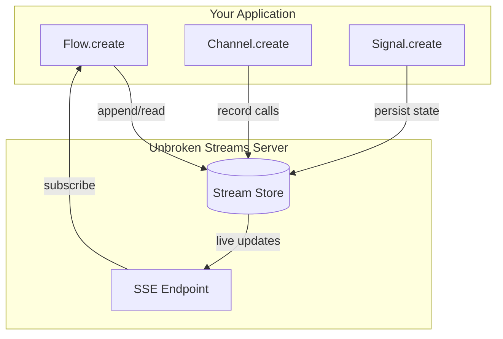
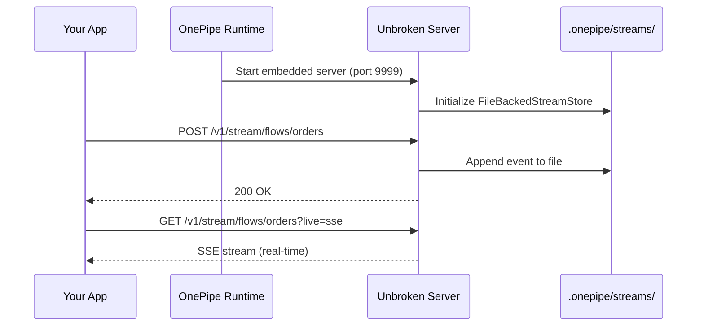
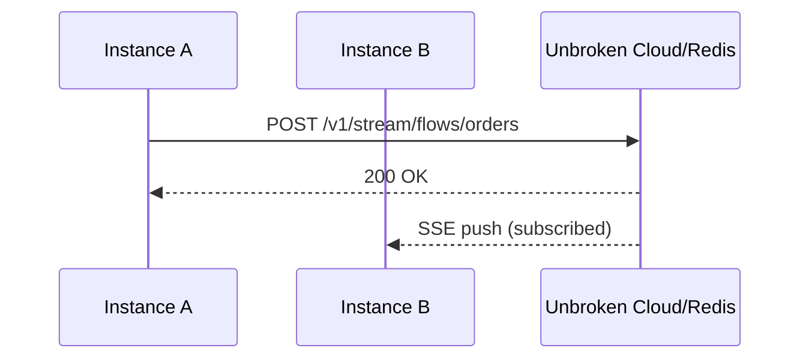

# Streams (Unbroken Protocol)

OnePipe uses the **Unbroken Protocol** for durable event streaming.

## Overview



## Architecture

### Development Mode (Embedded)



### Production Mode (External)



## Configuration

### Environment Variables

| Variable | Default | Description |
|----------|---------|-------------|
| `ONEPIPE_STREAMS_URL` | - | External streams server URL |
| `ONEPIPE_STREAMS_PORT` | `9999` | Embedded server port |

### Development (Embedded)

```typescript
import { serve } from '@onepipe/runtime'

serve({
  port: 3000,
  flows: [orderEvents],
  // Automatically starts embedded Unbroken server on :9999
})
```

### Production (External)

```bash
# Use managed Unbroken service or self-hosted
export ONEPIPE_STREAMS_URL=https://streams.example.com
```

## Stream Store Options

### FileBackedStreamStore (Development)

```typescript
// Automatically used in development
// Stores events in .onepipe/streams/
```

### RedisStreamStore (Production)

```typescript
// Set REDIS_URL for Redis-backed streams
export REDIS_URL=redis://localhost:6379
```

### PostgreSQL (Cloud-Native)

For multi-instance deployments, use Flow's built-in PostgreSQL:

```typescript
const events = Flow.create('orders')
  .schema(OrderEventSchema)
  .db(postgres)  // Use PostgreSQL instead of Unbroken
  .build()
```

## API Endpoints

The Unbroken server exposes:

| Endpoint | Method | Description |
|----------|--------|-------------|
| `/v1/stream/flows/{name}` | POST | Append event |
| `/v1/stream/flows/{name}` | GET | Read events |
| `/v1/stream/flows/{name}?live=sse` | GET | SSE subscription |
| `/v1/stream/channels/{name}/calls` | POST | Record channel call |
| `/v1/stream/signals/{name}` | GET/POST | Signal state |
| `/health` | GET | Health check |

## When to Use What

| Scenario | Storage | Why |
|----------|---------|-----|
| Local development | FileBackedStreamStore | Simple, no dependencies |
| Single instance prod | FileBackedStreamStore | Works fine |
| Multi-instance prod | PostgreSQL (`.db()`) | Shared state |
| High-throughput | Redis/Unbroken Cloud | Purpose-built |
